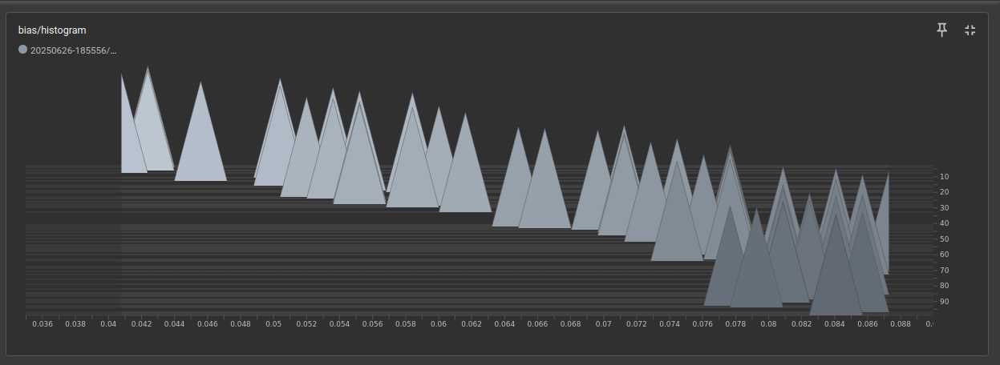
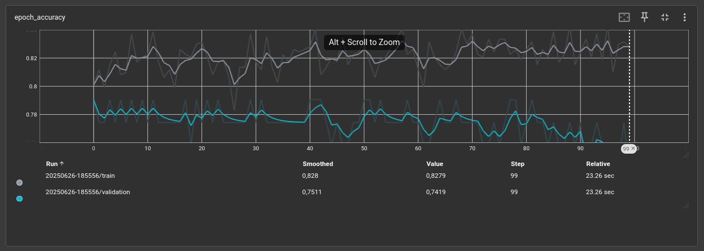
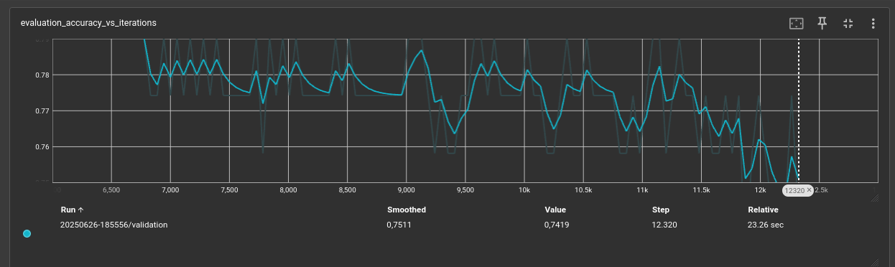
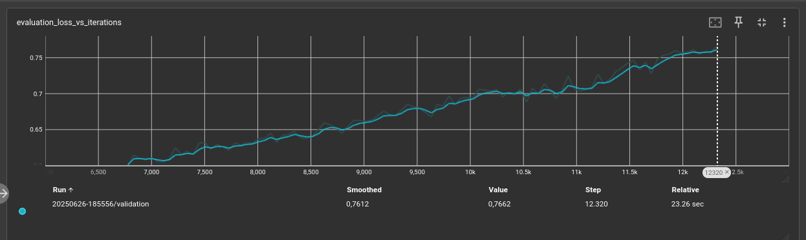
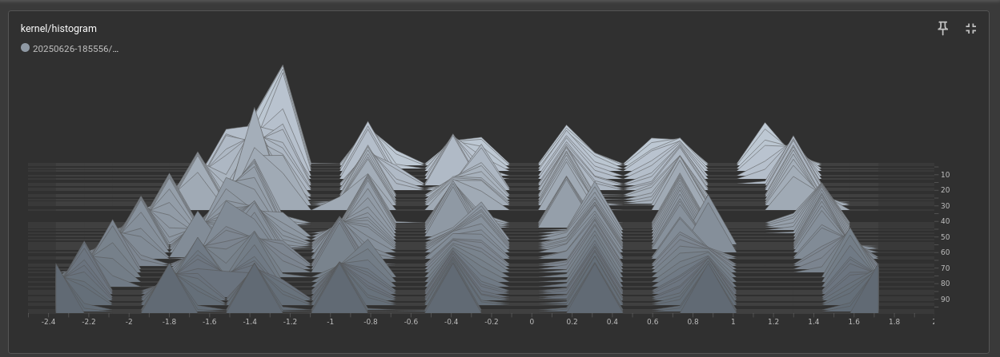

# MLP para Diagnóstico de Diabetes

## Descrição
Projeto de rede neural (MLP) para previsão de diabetes usando TensorFlow/Keras.

## Como Executar
```bash
git clone https://github.com/seu-usuario/mlp-diabetes.git
cd mlp-diabetes
pip install -r requirements.txt 
```
## Monitoramento 

```bash 
tensorboard --logdir logs
```

## Dados:

#### Dataset: Pima Indians Diabetes

# Resultados obtidos com a ferramenta TensorBoard

### Histograma com do bias:

### Acuracia

### Acuracia durante as iterações

### Perda durante as iterações:

###   Uso do kernel:
